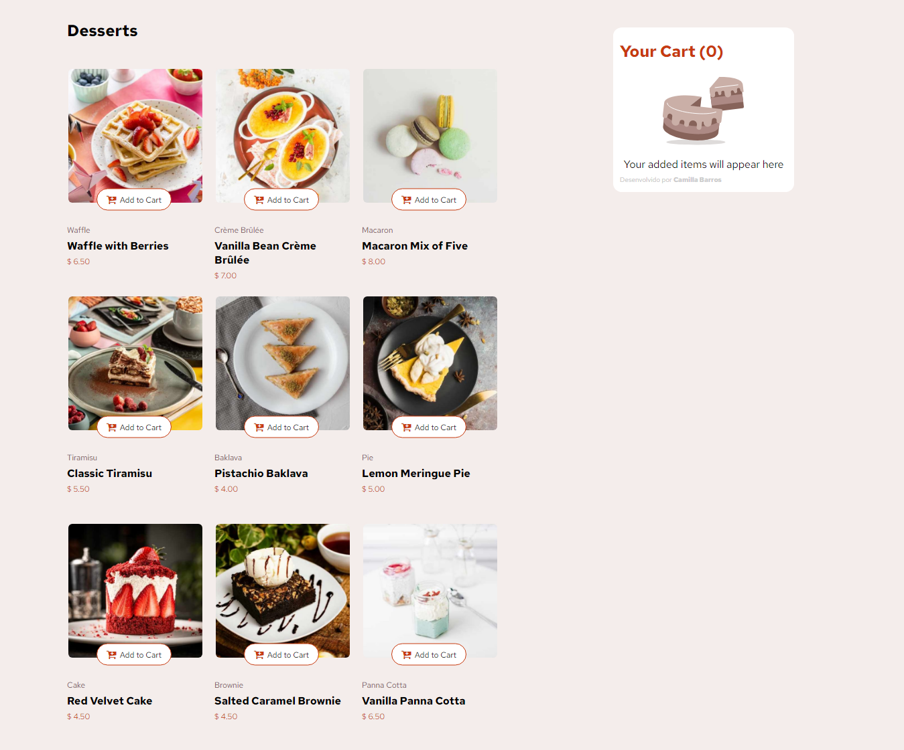
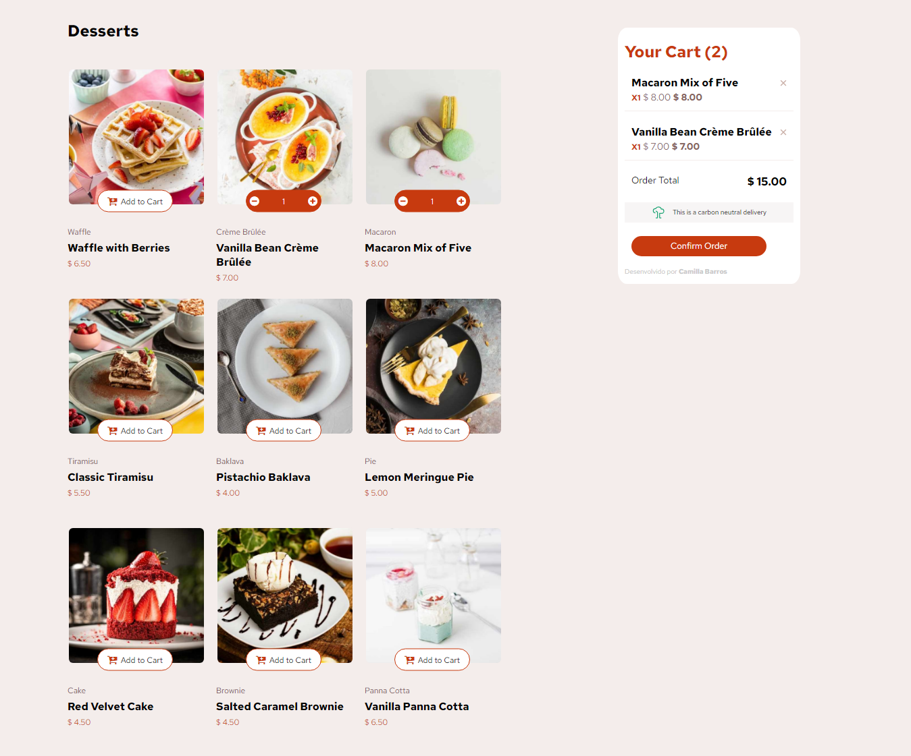

# Product list with cart

Product List with Cart é a interface de um aplicativo web que permite aos usuários visualizar e interagir com uma lista de produtos, especificamente sobremesas, além de gerenciar um carrinho de compras. O projeto foi desenvolvido com HTML, CSS, TypeScript e Vite.

## Visualize o Projeto

Você pode ver o projeto em funcionamento através do link: [Product list with cart](https://product-with-cart-web.netlify.app).

_Tela principal_


| Item adicionado ao carrinho               | Modal de confirmação do pedido                |
| ----------------------------------------- | --------------------------------------------- |
|  |  |

## Estrutura do Projeto

O projeto é composto pelos seguintes arquivos principais:

- index.html: A página principal que exibe a lista de produtos e o carrinho de compras.
- src/entites/product.ts: Define a classe Product, que contém a lógica para gerenciar os produtos, incluindo suas propriedades e métodos para renderização.
- src/app.ts: Script principal que inicializa a aplicação e gerencia a interação do usuário com a lista de produtos e o carrinho.
- src/css/index.scss: Define o design de toda a página.

## Funcionalidades

- Listagem de Produtos: Exibe uma lista de produtos com imagens, categorias, nomes e preços.
- Adição ao Carrinho: Os usuários podem adicionar ou remover produtos ao carrinho e ajustar a quantidade de itens.
- Visualização do Carrinho: Mostra os itens adicionados ao carrinho, suas quantidades e o total da compra.

## Para rodar o projeto no seu computador:

- Para clonar o repositório:

```bash
  git clone https://github.com/cabarros3/product-list-with-cart-web.git
```

- Instale as dependências:

```bash
  npm install
```

- Compile e Inicie o Projeto:

```bash
  npm run dev
```

## Tecnologias Utilizadas

- **HTML**: Estruturação da página.
- **CSS (SCSS)**: Estilização do layout e design responsivo.
- **TypeScript**: Lógica da aplicação e definição de tipos.
- **Vite**: Ferramenta de build e desenvolvimento.
- **UUID**: Para geração de IDs únicos para produtos.

**_Entre em contato comigo_**

- **LinkedIn**: [Camilla Barros](https://www.linkedin.com/in/camillabarros/)
